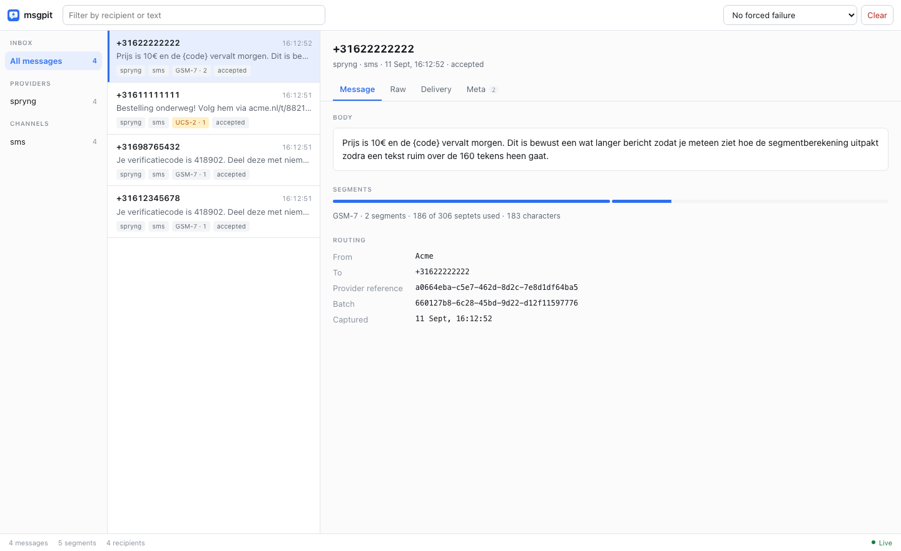

# msgpit

A local catcher for outgoing SMS and push messages. Mailpit, but for message provider APIs.

Your app keeps calling the provider SDK exactly as it does in production. Only the base URL
differs per environment: point it at msgpit and nothing is ever delivered. The request is stored,
a realistic provider response comes back, and everything shows up in a web UI.



## What it gives you

- Every captured message with its raw request, headers masked.
- Segment and encoding analysis per SMS: GSM-7 or UCS-2, how many segments, and which character
  forced UCS-2. That last one is usually the reason a message costs four times what you expected.
- Delivery reports on demand. Mark a message delivered or failed and msgpit calls your webhook
  the way the provider would, then shows the response.
- Forced failures, either through a magic recipient number or a one-shot toggle in the UI.
- New messages appear instantly over SSE, no refresh.

## Running it

As a Docksal service, add to `.docksal/docksal.yml`:

```yaml
services:
  msgpit:
    hostname: msgpit
    image: ghcr.io/<org>/msgpit:1
    volumes:
      - msgpit_data:/data
    labels:
      - io.docksal.virtual-host=msgpit.${VIRTUAL_HOST}
      - io.docksal.virtual-port=8080
    environment:
      - MSGPIT_SPRYNG_DLR_URL=http://web/webhooks/spryng

volumes:
  msgpit_data:
```

Or plain Docker:

```bash
docker run -p 8080:8080 ghcr.io/<org>/msgpit:1
```

The UI is on port 8080. Other containers reach the API at `http://msgpit:8080`.

Pin the major tag (`:1`). Breaking changes to routes or the `/api` contract get a major bump.

## Providers

### Spryng

API **v2** only. Base URL:

```
http://msgpit:8080/spryng/v2
```

The official PHP SDK accepts a base URL with a path, so this works as a drop-in without patching
anything. Authentication is `X-Api-Key`; msgpit checks the header is present and never looks at
the value.

Implemented: `POST /v2/messages` (202) and `GET /v2/balance` (201).

Spryng has no callback URL in the send request, since webhooks are configured account-wide. Set
`MSGPIT_SPRYNG_DLR_URL` to the endpoint in your app that would receive them.

See `src/Provider/Spryng/CLAUDE.md` for the full API notes.

## Documentation

The reference documentation lives in [`docs/`](docs/) and is served inside the application under
**Reference** in the sidebar, so it is there while you are testing:

- [Why msgpit exists](docs/01-why.md), and the design decisions behind it
- [Getting started](docs/02-getting-started.md)
- [Failure scenarios](docs/03-scenarios.md), including the magic recipient numbers
- [Encoding and segments](docs/04-segments.md)
- [Providers](docs/05-providers.md)
- [HTTP API](docs/06-api.md)

## HTTP API

The `/api` routes drive the UI and are meant for integration tests in consuming projects: assert
a message was sent, then clear.

| Route | Purpose |
|---|---|
| `GET /api/messages?provider=&channel=&to=&since=` | List messages, newest first |
| `GET /api/messages/{id}` | One message with its raw request and delivery reports |
| `DELETE /api/messages` | Clear all |
| `POST /api/messages/{id}/dlr` | `{"status":"delivered"}` sends a delivery report |
| `POST /api/scenario` | `{"scenario":"ServerError"}` fails the next provider request |
| `GET /api/providers` | Enabled providers and their capabilities |
| `GET /api/stream` | SSE stream of new messages and status changes |
| `GET /healthz` | Health check |

Example, asserting from a test:

```bash
curl -s http://msgpit:8080/api/messages?to=%2B31612345678 | jq '.messages[0].body'
curl -s -X DELETE http://msgpit:8080/api/messages
```

## Forcing failures

Two ways, both provider-agnostic.

**Magic recipients.** Send to `+31600000001` and up and the provider's own error response comes
back instead. The current list is in the app under Reference, and at `GET /api/scenarios`.

**One-shot toggle.** Pick a scenario in the UI, or `POST /api/scenario`. The next provider
request fails and the toggle clears itself.

Nothing is stored when a scenario fires: as far as your app is concerned the request never landed.
See [Failure scenarios](docs/03-scenarios.md).

## Configuration

| Variable | Default | |
|---|---|---|
| `MSGPIT_DB` | `/data/msgpit.sqlite` | SQLite path |
| `MSGPIT_PROVIDERS` | all | Comma-separated provider ids to enable |
| `MSGPIT_MAX_MESSAGES` | `1000` | Older messages are pruned beyond this |
| `MSGPIT_<PROVIDER>_DLR_URL` | - | Delivery-report callback, e.g. `http://web/webhooks/spryng` |

Data lives in SQLite at `MSGPIT_DB`. Losing it on a container reset is fine and expected.

## Development

This repo is itself a Docksal project. There is no web container: msgpit serves itself on 8080
and carries the vhost label.

```bash
fin up                  # UI at http://msgpit.docksal.site
fin exec composer install
fin exec composer test  # PHPUnit plus the Node tests for the Markdown renderer
fin exec composer stan  # PHPStan, level max
```

The source is mounted over `/app`, so changes are live without rebuilding. Composer is dev
tooling only: the runtime registers its own autoloader and needs no `vendor/`.

Send something by hand:

```bash
curl -X POST http://msgpit.docksal.site/spryng/v2/messages \
  -H 'X-Api-Key: anything' -H 'Content-Type: application/json' \
  -d '{"accountReference":"SPNL0000000","channel":"SMS","from":"Acme",
       "body":{"text":"Hello 👋"},"recipients":[{"msisdn":"+31612345678"}]}'
```

## Adding a provider

1. `src/Provider/<Name>/<Name>Provider.php` implementing `Provider`, plus a `CLAUDE.md` next to it
   documenting the API.
2. Implement only the endpoints your apps call. Mirror the real path, status codes and body shapes.
3. Add fixtures in `tests/fixtures/<id>/<case>/`.
4. Register the class in `providers.php`.
5. Run `fin exec composer test`. The contract test picks the provider up automatically.

Core never references a concrete provider, so adding one needs no core changes.
